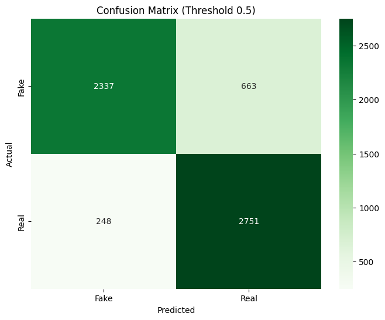
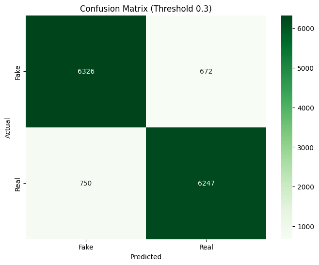

# 🛡️ Deepfake Detection Project : De la V1 à la V2

### [Click here to try the Streamlit App](https://ai-image-detector-amjen5txq2iyg3zktocmmd.streamlit.app/)

Ce projet documente l'évolution d'un classificateur CNN de pointe conçu pour identifier les images générées par IA. Le passage de l'Attempt 1 à l'Attempt 2 montre comment l'augmentation du volume de données, le changement d'activation (LeakyReLU) et l'optimisation du seuil de décision permettent de franchir le palier des 90% de précision.

---

## 🔬 Attempt 1 : Construction de la Baseline

### 1. Dataset Initial & Filtrage
Le premier objectif était de construire un dataset propre avec un seuil de résolution minimal de 256x256px.
* ✅ **Train :** 23 987 Fake | 23 978 Real
* ✅ **Val :** 3 000 Fake | 2 998 Real
* ✅ **Test :** 3 000 Fake | 2 996 Real
* 📊 **Total exploitable :** 59 959 images.

### 2. Architecture du Modèle : `AiDetectorCNN`
* **Structure :** CNN à 5 couches (32 -> 64 -> 128 -> 256 -> 512).
* **Normalisation :** `BatchNorm2d` sur chaque couche de convolution.
* **Classification :** Couche Fully Connected (512*8*8 -> 512) avec **Dropout (0.5)** et sortie Sigmoid.

### 3. Preprocessing & Augmentation
* **Transformations :** GaussianBlur (p=0.5), ColorJitter, RandomGrayscale.
* **Géométrie :** RandomHorizontalFlip et RandomRotation(15).

### 4. Performance à l'entraînement (Epoch 23)
* **Train Acc :** 87.53% | **Val Acc :** 88.58% | **Val Loss :** 0.2794
* **Metrics (Fake Class 0) :** Precision: 0.8774 | Recall: 0.8970 | **F1-Score : 0.8871**

### 5. Évaluation Finale & Seuil Optimal
* ✅ **Best Threshold found : 0.5**
* **Test Accuracy :** 84.81%
* **Classification Report (Seuil 0.5) :**
  - **Fake (Class 0) :** Precision 0.90 | Recall 0.78 | F1 0.84
  - **Real (Class 1) :** Precision 0.81 | Recall 0.92 | F1 0.86

**Matrice de Confusion Finale (A1) :** 

---

## 🚀 Attempt 2 : Optimisation & Dataset Massif (V2)

### 1. Répartition Finale du Dataset (140k images)
Après fusion des données et nettoyage rigoureux, le modèle a été entraîné sur un dataset massif.
* ✅ **Train :** 55 978 Fake | 55 973 Real
* ✅ **Val :** 6 997 Fake | 6 995 Real
* ✅ **Test :** 6 998 Fake | 6 997 Real
* 📊 **Total exploitables :** ~140 000 images.

### 2. Architecture Améliorée : `AiDetectorCNN`
* **Structure (la meme):** CNN à 5 couches (32 -> 64 -> 128 -> 256 -> 512).
* **LeakyReLU (0.1) :** Introduit pour éviter le problème des "neurones morts" et améliorer le flux de gradient.
* **BCEWithLogitsLoss :** Utilisation des logits bruts pour une meilleure stabilité numérique lors de l'entraînement.
* **Flatten Dynamique :** `x.view(x.size(0), -1)` pour une meilleure flexibilité de batch.

### 3. Preprocessing de Précision (Aspect Ratio Respecté)
* **Resize(260)** : Redimensionne le petit côté à 260px sans déformer.
* **CenterCrop(256)** : Extraction du carré central de 256x256px, garantissant que les proportions du contenu sont 100% respectées.

### 4. Performance Finale (Époque 30)
* **Train Acc :** 90.05% | **Val Acc :** 90.53% | **Val Loss :** 0.2381
* **Metrics (Fake Class 0) :** Precision: 0.9049 | Recall: 0.9058 | **F1-Score : 0.9054**

### 5. Évaluation Finale & Seuil Optimal
L'analyse de diagnostic a révélé que le modèle est plus performant avec un seuil de décision optimisé :
* ✅ **Best Threshold found : 0.3**
* **Test Accuracy : 89.84%**
* **Classification Report (Seuil 0.3) :**
  - **Fake (Class 0) :** Precision 0.89 | Recall 0.90 | F1 0.90
  - **Real (Class 1) :** Precision 0.90 | Recall 0.89 | F1 0.90

**Matrice de Confusion Finale (A2) :** 

---

## 💻 Déploiement Streamlit
Le modèle final est accessible en ligne pour tester vos propres images : 
👉 [Lien vers l'application](https://ai-image-detector-amjen5txq2iyg3zktocmmd.streamlit.app/)

---

## 🛠️ Stack Technique
* **Framework :** PyTorch (CNN, Computer Vision)
* **Data Science :** Scikit-learn, Numpy, Pandas
* **Interface :** Streamlit
* **Logs :** TQDM